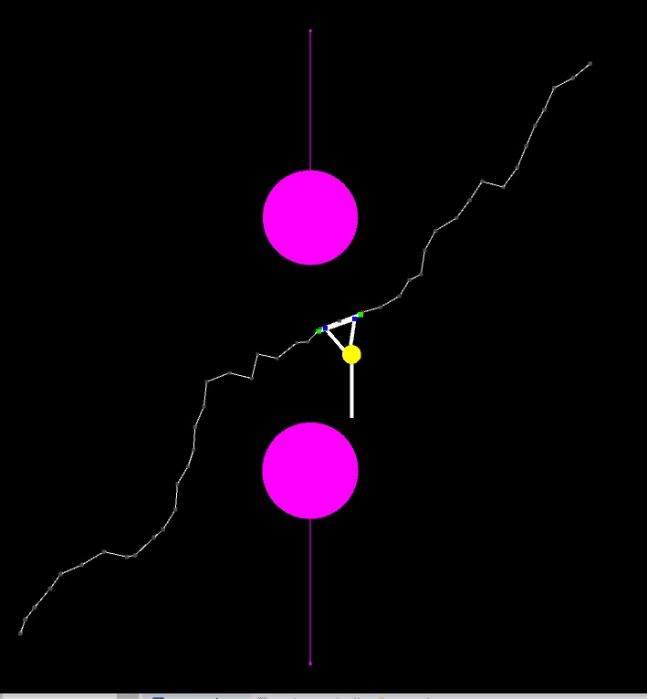
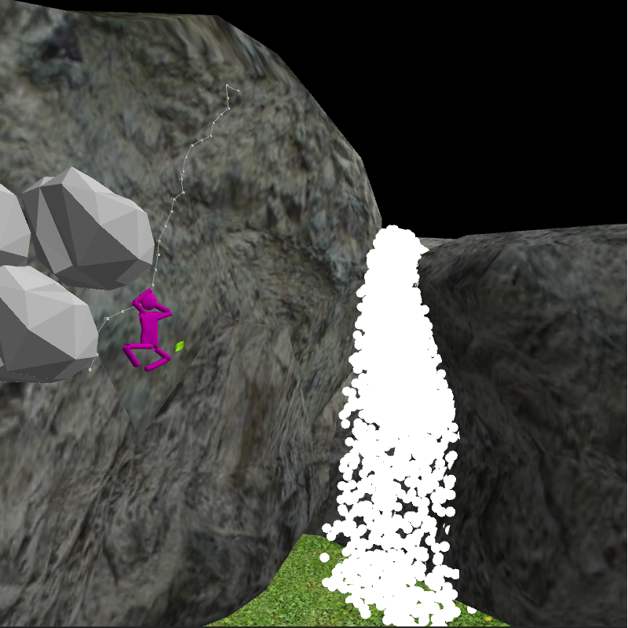
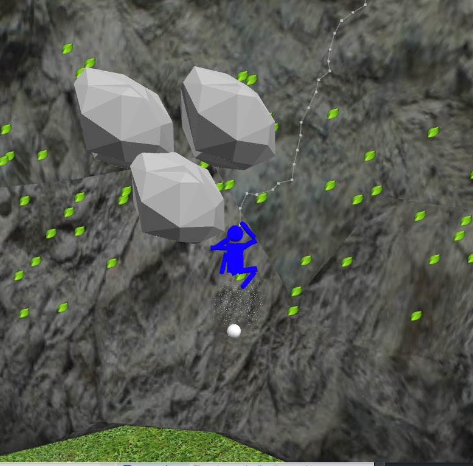

# stick-solo
## description
- Simple planning methods for 2D stick-figure climbing agents.
- Climbing route is generated by probabilistic roadmap and A\* search.
- Stick figure movements are computed using (analytical/iterative) inverse kinematics.
 - Details on core ideas can be found in `report.pdf`
## usage
- Code is written in java, should work with JRE 8+.
    - `src/` contains all source code.
    - `jars/` contain all libraries bundled as jars.
        - processing is used as a rendering library
    - `data/` contains resources such as images, obj, mtl files.
- Open a terminal at project root (the directory containing this file).
- Use `javac -Xlint:unchecked -cp "jars/processing/*:jars/ejml-v0.39-libs/*:jars/minim/*" -d build/ $(find -name "*.java")` to compile and put all output class files under `build/`.
- Use `java -cp "build/:jars/processing/*:jars/ejml-v0.39-libs/*:jars/minim/*" <package>.<to>.<path>.<class>` to run any simulation.
    - For example `java -cp "build/:jars/processing/*:jars/ejml-v0.39-libs/*:jars/minim/*" demos.serialagent.RRAnalyticalAgentOnPRM`.
- Tested on Ubuntu 18.04
    - If you use a distrubution that uses rolling release cycle (like Arch) you might have to install some older version of JRE and mesa (opensource intel openGL driver) that work with processing library.
## demonstration
### videos
- Our progression from building a two-link agent to a human-like agent is illustrated in the following videos.

- A 2-link analytical agent

- A 4-link jacobian transpose (iterative) agent

- A 4-link pseudo inverse (iterative) agent

- Simulating worms using large-count-small-length link agents

- A 2-arm agent

- A 2-arm 2-leg agent

- Race b/w 2-arm 2-leg agents

- A 2-arm 2-leg agent in the wild (replanning on rock slip, energy depletion, wind, waterfall)

### images
- 4-link agent using jacobian-transpose

- 4-link agent using pseudo-inverse method

- Worm agent's tail moving to the red node

- 2-arm agent avoiding obstacles

- Simulated waterfall using a particle system

- Wind effects, leaves and falling stones

